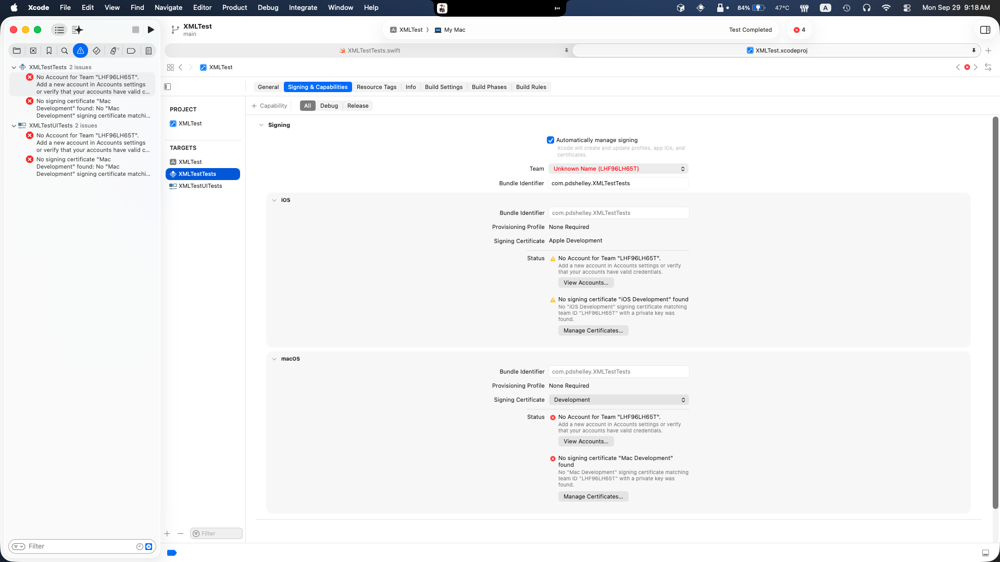

# HALGEN

## Quick-Start Guide (Building, Running, and Testing)
### Setting things up
1. Begin by cloning the repository through a Terminal, Xcode, or Git Client of choice.
For Example: `git clone https://github.com/pdshelley/HALGEN.git`

2. Open the project using Xcode (if you haven't cloned it through Xcode)

### Running it
1. Press the "Run" button within Xcode

2. A window named "XMLTest" should pop up.

3. Click "Select Files". A Finder window will pop up.

4. Select your ATDF file(s), followed by "Open".

5. Click "Decode ATDF Files". If you see nothing happening, this is normal. Don't panic!

6. Click "Export". A "Save" popup will appear. Enter your desired output directory name, and click "Save"

7. Using Finder, go to the directory name you just entered. You will find Swift mappings for each ATDF file you decoded earlier.

### Testing
1. Go to any of the test files and try to run it. You will quickly notice this fails, giving 4 errors relating to certificates.

2. Open the Xcode Project File, go to the "XMLTestTests" Target, "Signing & Capabilities". Here, you will see some warnings and errors, and a noticable "Unknown Name" error where your team name is supposed to be.

3. Change the Team to one of your own. All other errors should go away as well.

4. Repeat the same for the "XMLTestUITests" Target.

5. If you now try to run the tests again, they will fail again, this time with another error.

6. Once again, open the Xcode Project File, but this time, go to the "XMLTest" Target, "Signing & Capabilities". Here, you will see that team is "None". Change that to one of your own teams.

7. If you try running the tests now, they will all run successfully.
- Running `XMLTestUITests/XMLTestUITests.swift` will cause the application to appear to flicker and re-launch multiple times. This is normal.
- Running `XMLTestUITests/XMLTestUITestsLaunchTests.swift` will cause the application to appear to not do anything for a long time. This is normal. The test will take around 2 minutes total (on a 2023 M2 MacBook Air 24 GB, but your mileage may vary).
